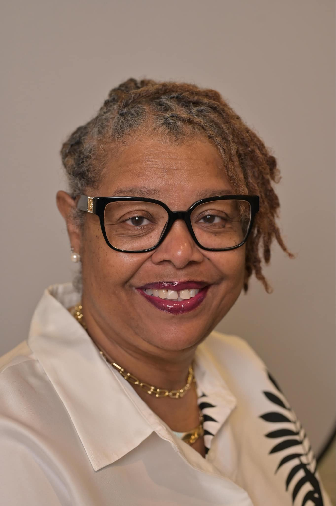

<h1><b> FacultyHack@Gateways 2026 Curriculum Project </b></h1> 

<h2><b>Project Overview </b></h2>

This curriculum project focuses on integrating <b>Jetstream2, Artificial Intelligence (AI), and Science Gateway</b> resources into an Introduction to Programming course to give students hands-on experience with modern research computing environments.  

<h2><b> Course: CMP 224 Introduction to Programming </b></h2>

The CMP 224 Introduction to Programming course is an introductory programming course designed for beginning computer science students, including students with limited or no prior programming experience. The course serves as a foundational course in the computing curriculum, introducing computational thinking, problem-solving, programming concepts, and emerging technologies that students will use in subsequent computer science courses.  

The project is motivated by the need to provide students with authentic exposure to high-performance/cloud computing, artificial intelligence, and modern development environments early in their academic careers. Integrating Jetstream2 and Science Gateway resources with AI-supported programming gives students access to scalable computing resources while reducing the technical barriers associated with configuring local environments. The project addresses the gap between traditional introductory programming instruction, and the increasingly AI- and cloud-driven computing environments students will encounter in advanced coursework and the workforce.  

The primary goal is to move students beyond working only on their local computers by introducing them to scalable computing, reproducible scientific workflows, AI-enabled research tools, and shared cyberinfrastructure. The revised curriculum will emphasize practical access to HPC and AI resources through user-friendly interfaces and Science Gateways, allowing students to focus on solving problems and analyzing data without requiring them to first become HPC system administrators.  

The project will also explore how tools such as Jetstream2 and Science Gateways can be incorporated into assignments and course projects in ways that are accessible to students with different levels of computing experience.   

<h2><b> Faculty Information </b></h2> 

Cheryl Swanier  
 Voorhees University  
 Science, Technology, Health, and Human Services 

<h2><b>Brief Bio</b></h2>

Dr. Cheryl A. Swanier is a computer scientist, educator, researcher, and higher education leader with more than two decades of experience advancing academic excellence, faculty development, and student success. She most recently served as Dean of the School of Science, Technology, Health, and Human Services at Voorhees University, where she also holds the rank of Full Professor of Computer Science. 

Prior to her appointment as dean, Dr. Swanier served as a Senior Teaching Professor in the Manning College of Information and Computer Sciences at the University of Massachusetts Amherst, where she taught undergraduate computer science courses and contributed to innovative approaches in computing education. Earlier, she served as Chair of the Department of Mathematics and Computer Science at Claflin University, where she held the prestigious Henry N. and Alice Carson Tisdale Endowed Professorship. During her tenure, she led the successful ABET accreditation of the Computer Science program, expanded academic offerings, and championed initiatives that strengthened student achievement and faculty excellence.

Dr. Swanier's interdisciplinary expertise spans artificial intelligence, human-computer interaction, computer science education, data science, and cybersecurity. Throughout her career, she has taught a broad range of undergraduate and graduate courses while leading curriculum innovation, accreditation, strategic planning, assessment, and academic program development. Her professional experience also includes serving as a software engineer in industry, a secondary mathematics educator, and a Visiting Research Scientist at Google, where she collaborated on initiatives to broaden participation in computing at Historically Black Colleges and Universities. 

Dr. Swanier has extensive experience in faculty leadership, accreditation, strategic enrollment initiatives, grant development, and interdisciplinary collaboration. Her scholarship focuses on human-computer interaction, computing education, artificial intelligence, and broadening participation in STEM, with numerous presentations and publications at national and international conferences.

As an academic leader, Dr. Swanier is committed to cultivating inclusive learning environments, advancing faculty excellence, leveraging emerging technologies to improve teaching and learning, and preparing the next generation of innovative, ethical, and socially responsible computing professionals.

    

<h2><b>Mentorship & Support</b></h2>

<b>Assigned Technical Mentor(s):  </b> 

Anas AlSobeh  
Utah Valley University  
ana.alsobeh@uvu.edu 

 
<h2><b>Science Gateway Resources & Technology Notes</b> </h2> 

The course goal is to integrate Science Gateway resources, including Jetstream2 cloud computing infrastructure and AI-enabled tools, into an introductory programming course to provide students with accessible, authentic, and scalable computing experiences that strengthen computational thinking, programming skills, and AI literacy.

<h2><b>Tools Used </b> </h2> 

<b>Jetstream2 </b>  https://jetstream-cloud.org/.  

<ul><b>•	Description:</b> 
 

Jetstream2 is an NSF-supported, user-friendly cloud computing environment that provides interactive virtual machines, data analysis capabilities, and access to AI resources. It is designed specifically to lower barriers for users who are new to advanced computing and is particularly focused on workforce development at small colleges, HBCUs, and minority-serving institutions. 

<b>•	Course Use:</b>  
Students will use Jetstream2 to create cloud-based programming environments, execute and debug JAVA programs, work with datasets, and complete computational projects without requiring powerful personal computers.

Students will use Jetstream2 to learn to critically evaluate AI-generated code for accuracy, bias, security, and responsible use. Science Gateway resources will supplement these activities by exposing students to research-oriented computational tools and workflows. Together, these platforms create an accessible pathway for beginning programmers to move from foundational programming concepts to authentic cloud, AI, and computational experiences.

The course will also leverage Jetstream2's institutionally operated LLM inference service as an AI programming assistant for code generation, explanation, debugging, and problem-solving.
</ul>

<b>ACCESS</b> https://access-ci.org/  

<ul>
<b>•	Description:</b> 

ACCESS provides researchers and educators with access to advanced computing, storage, visualization, and other cyberinfrastructure resources contributed by organizations across the United States.
 
<b>•	Course Use: </b> 

ACCESS resources can introduce students to nationally available research cyberinfrastructure and provide a pathway for moving course projects beyond local computing environments. </ul>

<b>•	Jetstream2 LLM Inference Service</b> https://support.access-ci.org/tools/science-gateways?utm_source=chatgpt.com 
<ul><b>•	Description:</b> 

Jetstream2 provides an institutionally operated large-language-model inference service that students can use for programming assistance, debugging, brainstorming, and developing LLM-powered applications. The service currently includes models such as Llama 4 and gpt-oss-120b and processes data within the Indiana University environment rather than sending prompts to commercial AI providers.etstream2 

<b>•	Course Use:</b>

Students will use the service as an AI programming partner to generate and explain code, troubleshoot errors, compare programming approaches, and critically evaluate AI-generated solutions.
 </ul>

<b>Science Gateways Gateway Resources – ACCESS Ecosystem</b> https://www.tacc.utexas.edu/ 
<ul><b>•	Description:</b>

Science Gateway resources will be used to connect students to accessible, research-oriented computational tools and environments that complement Jetstream2. Jetstream2 itself supports science gateways and provides web-based interfaces and preconfigured virtual machines that simplify access to advanced computing resources.

<b>•	Course Use:</b> 

Students will explore selected gateway resources to experience how professional and research communities use cloud computing, data, software, and computational workflows to solve real-world problems.
</ul>

<h2><b>Implementation Notes</b></h2>
<ul>
<b>•	Session 1:</b> 
Reviewed the existing introductory programming course structure, learning objectives, assignments, and projects to identify opportunities for integrating AI, cloud computing, Jetstream2, and Science Gateway resources. Identified the transition points where students could move from traditional local programming environments to shared cloud-based computing infrastructure. Particular attention was given to maintaining foundational Java programming skills while introducing students to emerging AI and cloud technologies.
 
 
<b>•	Session 2:</b> 
Explored potential workflows using Jetstream2, ACCESS, Science Gateway resources, Jupyter/JupyterHub, and AI-supported programming tools. Focused on identifying resources that would be accessible to beginning programmers and would minimize the technical barriers associated with setting up programming and cloud environments. Considered how students could use AI for code generation, explanation, debugging, and problem-solving while learning to critically evaluate AI-generated code.
  
 
<b>•	Session 3:</b> Began translating the selected technologies into a structured classroom workflow. Developed a progression in which students first establish Java programming fundamentals, followed by responsible AI use and AI-assisted programming, an introduction to cloud computing, and access to Jetstream2 virtual computing environments. Planned student activities involving programming, data analysis, visualization, Jupyter-based work, and introductory machine learning. Also began incorporating professional practices such as documentation, testing, debugging, reproducibility, data management, and evaluation of AI-generated solutions into course assignments.
 
 
<b>•	Session 4:</b> Refined the instructional pathway and identified specific course modules and assignments for implementation. Examined how Jetstream2 and Science Gateway resources could be introduced incrementally so that students develop programming confidence before transitioning to cloud-based computing. Continued developing student-facing instructions, tutorials, assessment criteria, and responsible AI guidelines. Considered potential challenges related to account creation, authentication, technical support, computing allocations, and student access, and identified strategies for reducing these barriers.
  
  
<b>•	Session 5:</b> Developed the AI + Java + Jetstream2 + Science Gateway course pathway. Students begin with computing and Java fundamentals, progress to AI literacy and AI-assisted programming, and then transition to cloud computing and Jetstream2. Later modules incorporate data analysis, visualization, introductory machine learning, and an authentic AI/cloud computing project. Assessment was expanded beyond traditional code submissions to include AI-assisted programming activities, cloud-based projects, reflections, code evaluation, documentation, testing, and reproducibility.
  
  
<b>•	Final Implementation:</b> The redesigned course will integrate Jetstream2, Science Gateway resources, and AI-supported programming activities throughout the semester rather than treating them as standalone topics. Students will begin in a familiar local programming environment, develop foundational Java skills, and progressively transition to cloud-based computational environments. The final project will require students to apply programming, AI, cloud computing, data, and problem-solving skills to an authentic computational problem. Implementation will be evaluated through student programming performance, project completion, engagement, confidence with computing, ability to evaluate AI-generated code, and reflections on their experience using cloud and AI resources. Findings from the implementation will be used to refine the course, improve student support materials, and develop a scalable model for incorporating Science Gateway and advanced computing resources into additional courses.
</ul>
<h2><b>Deliverables Checklist</b></h2>

•	 Original Syllabus :  [Original Syllabus](./CMP224VUSyllabus2026.pdf)

•	 Revised Syllabus: revised_syllabus.pdf

•	 Gateways 2026 Poster: poster_final.pdf

•	 SGX3 Blog Post Draft: blog_post.md. 

 
<h2><b>Event Details</b></h2>
•	Virtual Hackathon: August 3 – 14, 2026
•	In-Person Conference: Gateways 2026 | September 23–25, 2026 | Washington, D.C.
 
<h2><b>Event Citation </b></h2>

This project was developed as part of SGX3's 5th Annual FacultyHack@Gateways 2026. FacultyHack is a hands-on program designed to empower educators across disciplines to integrate High-Performance Computing (HPC) and Artificial Intelligence (AI) tools directly into their curricula.

FacultyHack provides participants with technical mentorship, hands-on experience with advanced cyberinfrastructure, and an opportunity to transform what they learn into practical instructional materials that can be used with their students. The program emphasizes reducing barriers to HPC, AI, Science Gateways, and national research cyberinfrastructure while creating sustainable pathways for these technologies to reach new institutions, faculty, and students.

For more information, event archives, and resources, please visit the official event site:
FacultyHack@Gateways 2026 Official Site

